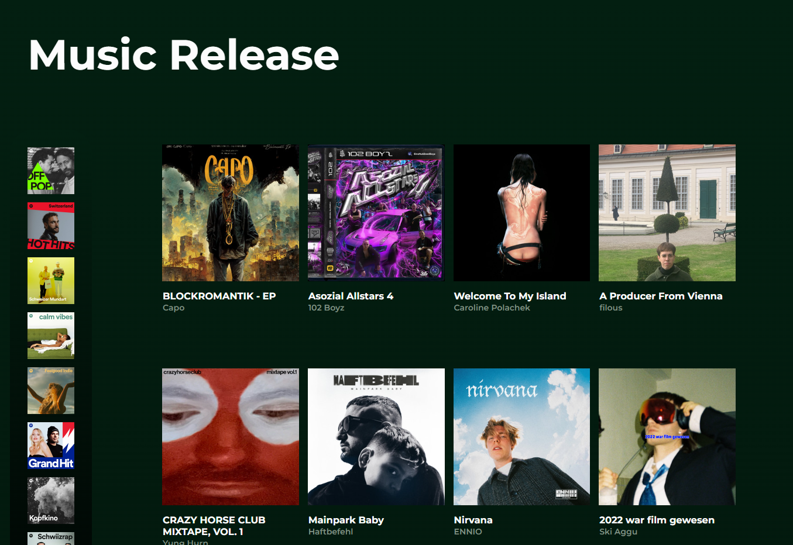

<h1 align="center">
  
</h1>

# Music Releases
A React+Vite app to display newly released music. Features include 
* an orgniazed React component structure 
* a display area for all the released albums
* a side bar for all the playlist
* hovering over the album covers for "play, like and more" icons, and detailed description over playlist covers.
* clicking on album&playlist covers, play icons and playlist covers links to external URLs to Spotifu.
* UI design for smooth user interactions. 

### The Problem

### View it live

